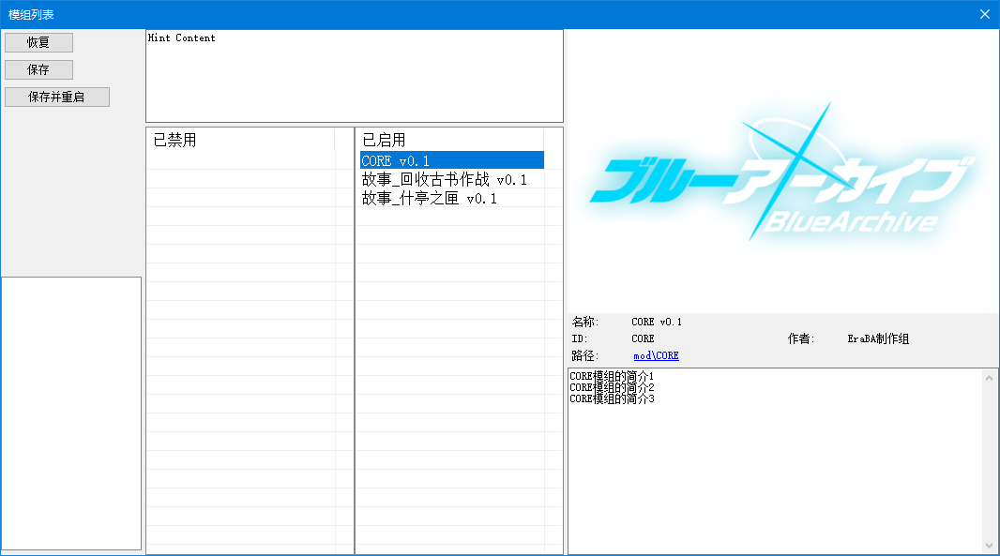
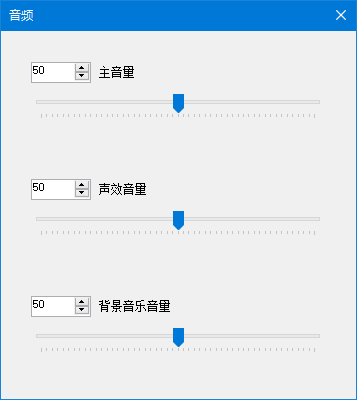

# 紹介 {#Introduction}

<center>

</center>

**EmueraBA** ランチャーは、[**`EmueraEE+EM`**](https://gitlab.com/EvilMask/emuera.em) ランチャーを基に修正されたもので、現在は `.NET Framework 4.8` プラットフォームで構築されています。

ランチャーのデフォルトタイトルは `EmueraBA` に変更され、デフォルトのアイコンも更新されました。

グラフィックライブラリは [**`SkiaSharp`**](https://github.com/mono/SkiaSharp) に置き換えられました。画面表示と画像描画に関連するすべての機能はSkiaSharpに移行され、**`描画インターフェース`** 設定項目は削除されました。

自動文字範囲認識機能が実装され、中国語、日本語、韓国語、英語、および絵文字の文字を正しく認識し、長さを計算できるようになりました。**`内部で使用する東アジア言語`** 設定項目は削除されました。

表示設定画面に新しい **`タブ文字幅`** 設定項目が追加されました。この設定項目は、テキスト内の `タブ文字(\t)` の文字幅を調整し、デフォルト値は `8` です。  
タブ文字は、前のテキストの文字幅に基づいて自動的に自身の文字幅を調整します。例えば、タブ文字の前に `111` というテキストがある場合、現在のタブ文字は5文字分の幅を占めます。

ユーザー定義変数キーワード **`RESIZE`** を追加しました。このキーワードは、サイズ変更が必要な配列をマークするために使用されます。このキーワードの詳細な使用方法については、[**`ARRAYRESIZE`**](new_com#arrayresize) を参照してください。

----
### モッド機能 {#ModuleFunc}

:::info[モッド機能]

**新しいモッド読み込みメカニズムが追加され、ランチャーのメニューバーに `モッドリスト` ダイアログウィンドウが追加されました。ここで、モッドの表示、有効/無効の切り替え、および読み込み順序の調整ができます。**

<center>

</center>

モッドを追加するには、以下の手順に従ってください：

- ゲームのメインディレクトリに `mod` フォルダを作成します。このフォルダが **モッドのメインディレクトリ** となります。
- `mod` フォルダ内に、任意の名前の **モッドフォルダ** を作成します。例えば `MyMod` とします。
- `MyMod` フォルダ内に、**モッド識別ファイル** として `_mod.csv` という名前のファイルを作成し、以下の表の属性に従って内容を記入します：

|属性         |説明|
|:---:        |---|
|ID           |モッドの一意の識別子。この識別子が空であるか、他のモッドと重複している場合、モッドは認識されません。**ID名は関数命名規則に従い、作成後の変更は推奨されません**。|
|Name         |モッドの表示名。|
|Authors      |モッドの作者名。|
|Cover        |モッドの表示カバー。モッド内の画像を読み込むには、`{0}` をモッドのパスとして使用します。例：`{0}resources/cover.png`|
|Description  |モッドの表示説明。改行が可能です。**Description属性は他の属性の後に記述してください**。|

```csv title="ファイルパスと例：mod/MyMod/_mod.csv"
ID,MyMod
Name,私のmod v1.0
Authors,Tom & Jerry
Cover,{0}resources/cover.png
Description,私のmodの説明
私のmodの説明1
私のmodの説明2
```

次に、モッドフォルダ内に以下のリソースファイルを追加できます：

- `ERB` フォルダを作成し、`ERB、ERH、ERD` ファイルを追加します。
- `resources` フォルダを作成し、`csv、png、jpg、webp` などの画像リソースを追加します。
- `sound` フォルダを作成し、`csv、m4a、aac、wav、mp3` などの音声リソースを追加します。
- `text` フォルダを作成し、`json` 形式の多言語リソースを追加します。
- `font` フォルダを作成し、`ttf、otf` 形式のフォントリソースを追加します。

モッドフォルダ内のリソースファイルは、ゲームのメインディレクトリ内のリソースファイルと同様に扱われます。ファイル名に制限はありませんが、モッド間のリソース重複に注意してください：

- `ERB、ERH、ERD` ファイルに重複する内容がある場合、後ろのモッドの内容はスキップされ、警告が表示されます。
- Spriteリソースに名前の重複がある場合、同じモッド内の重複はスキップされ、警告が表示されます。異なるモッド間では、後ろのモッドの内容が優先されます。
- Audioリソースに名前の重複がある場合、同じモッド内の重複はスキップされ、警告が表示されます。異なるモッド間では、後ろのモッドの内容が優先されます。
- 多言語リソースにキーパスの重複がある場合、後ろのテキストおよびモッドの内容が優先されます。
- フォントリソースにフォント名の重複がある場合、後ろのモッドの内容が優先されます。

:::

----
### 多言語機能 {#Multilingual}

:::info[多言語機能]

**多言語機能を使用すると、開発者はゲーム内のテキストを整理してローカライズ翻訳を行うことができます。実行時に、ランチャーは利用可能な言語コンテンツを自動的に統合し、多言語テキストを迅速に表示します。**

多言語テキストを追加するには、以下の手順に従ってください。ここでは `簡体字中国語` を追加する例を示します：

- ゲームのメインディレクトリに `text` フォルダを作成します。このフォルダが **多言語のメインディレクトリ** となります。
- `text` フォルダ内に、**地域言語フォルダ** を作成します。フォルダ名は [**`ロケール言語`**](https://learn.microsoft.com/openspecs/windows_protocols/ms-lcid/a9eac961-e77d-41a6-90a5-ce1a8b0cdb9c) ドキュメントの `言語タグ(Language tag)` を参照してください。
  - 上記ドキュメントを参照すると、`Chinese (Simplified)` の地域名は `zh-CN` であり、これがフォルダ名となります。
  - フォルダ名は大文字小文字を区別せず、`アンダースコア(_)` または `ハイフン(-)` を使用できますが、大文字と `アンダースコア(_)` に統一することを推奨します。例：`ZH_CN`。
- `ZH_CN` フォルダ内に任意の `json` ファイルを作成し、以下の例のように内容を記入します：

```json title="ファイルパスと例：text/ZH_CN/text.json"
{
  // これはコメントです。

  "キー": "内容",
  "START_GAME": "ゲームを開始",
  "ITEM": "アイテム",
  "ITEM":
  {
    "APPLE":
    {
      "NAME": "りんご",
      "DESC": "果物の一種",
    },
    // 注意：キー名に改行文字(\n)を含めないでください。例えば BA\nNANA は無効なキー名です。これは、ランチャーがこの文字を使用して言語コンテンツを統合するためです。
    "BANANA":
    {
      "NAME": "バナナ",
      "DESC":
      [
        "大きなバナナ、一本の大きなバナナ",
        "あなたの感じ方は本当に不思議ですね",
      ],
    },
  },
}
```

これで、`簡体字中国語` の多言語テキストが追加されました。次に、設定でこの言語を有効にする必要があります：

- ランチャーを開き、`モッドリスト` に移動します。ウィンドウの左下に `多言語リスト` オプションが表示され、`中国語` が追加されています。ダブルクリックして有効にし、`保存` ボタンをクリックします。
  - 複数の言語を追加した場合、有効な言語をドラッグして表示順序を調整できます。リストの最上部が最優先されます。
  - また、`モッドリスト` でモッド間のキーパスが重複している場合、前のモッドのテキスト内容が後ろのモッドに置き換えられます。
  - `多言語リスト` を変更した後、プログラムを再起動して言語テキストキャッシュをリセットし、定数文字列にリファクタリングされたすべてのコードをリセットする必要があります。

最後に、コード内で [**`TEXT`**](new_com#text) と [**`TEXTLIST`**](new_com#textlist) コマンドを使用して多言語テキストを取得します。jsonファイルで定義したキーパスを入力するだけです：

```
LOCALS '= TEXT("start_game")		; 「ゲームを開始」というテキストを取得。キー名は大文字小文字を区別しません。
PRINTSL TEXT("ITEM")			; 「アイテム」を表示
PRINTSL TEXT("ITEM", "APPLE", "DESC")	; 「果物の一種」を表示

TEXTLIST LOCALS, "ITEM", "APPLE", "DESC"
PRINTSL LOCALS:0			; 「果物の一種」を表示
TEXTLIST LOCALS, "ITEM", "BANANA", "DESC"
PRINTSL LOCALS:0			; 「大きなバナナ、一本の大きなバナナ」を表示
PRINTSL LOCALS:1			; 「あなたの感じ方は本当に不思議ですね」を表示
```

:::

----
### 音声機能 {#AudioFunc}

:::info[音声機能]

**音声コンポーネントは [**`CSCore`**](https://github.com/filoe/cscore) に置き換えられ、ランチャーのメニューバーに新しい `音声` ダイアログウィンドウが追加されました。ここで、さまざまな音量設定を調整できます。**

<center>

</center>

画像リソースと同様に、`resources` リソースフォルダにオーディオファイルを配置し、CSVファイルを作成して **Audioリソース** を定義することで、よりカスタマイズされた音声効果を得ることができます。  

```csv title="Audioリソースのフォーマットと例："
; Audio名,音声ファイル名,音量(100),開始時間(00:00:00),再生時間(音声ファイルの総再生時間)
MyMusic,MyMusic.mp3
MyMusic1,MyMusic1.mp3,100
MyMusic2,MyMusic2.m4a,80,00:01:30
MyMusic3,MyMusic3.wav,70,00:01:30,15000
```

`開始時間` と `再生時間` は `TimeSpan` または `ミリ秒(ms)` 値を受け入れます。`TimeSpan` の書式については、[**`TimeSpan.TryParse`**](https://learn.microsoft.com/dotnet/api/system.timespan.tryparse?view=netframework-4.8) ドキュメントの例を参照してください。

オーディオ機能の詳細については、[**`オーディオ関連`**](new_com#AudioRelated) コマンドをご参照ください。

:::

----
### Spineアニメーション機能 {#SpineAnimFunc}

:::info[Spineアニメーション機能]

[**`Spine ランタイム`**](https://zh.esotericsoftware.com/spine-runtimes) のサポートが追加され、Spineアニメーションファイルを読み取り、[**`SkiaSharp`**](https://github.com/mono/SkiaSharp) を使用して画面に描画できるようになりました。

現在、`3.8.xx` バージョンのSpineリソースのみサポートされています。

Spineリソースを追加するには、画像リソースを追加するのと同様の手順で行います。Spineリソースファイルを `resources` フォルダ内に配置し、以下の内容でcsvファイルを作成します：

```csv title="Spineリソースのフォーマットと例："
; Spineリソース名,atlasファイル,skelファイルまたはjsonファイル
aris_spine, aris.atlas, aris.skel
```

その後、コード内で [**`SPINECREATE`**](new_com#spinecreate)、[**`CBGSETSPINE`**](new_com#cbgsetspine) などのコマンドを使用してSpineアニメーションを読み込み、画面に表示できます。

```erb title="SPINE関連コマンドの使用例："
; アニメーションの更新間隔をミリ秒単位で設定
SETANIMETIMER 1000 / 60

; 指定したIDにSpineアニメーションを作成
SPINECREATE 0, "aris_spine"

; Spineアニメーションのスケールを50%に設定
SPINESETSCALE 0, 50

; SpineアニメーションにANIMを設定
SPINESETANIM 0, 0, "IDLE_01", 1
SPINESETANIM 0, 1, "00", 1

; 指定したSpineアニメーションを画面に表示
CBGSETSPINE 0, 0, 0, 1
```

Spineアニメーション機能の詳細については、[**`SPINE関連`**](new_com#SpineRelated) コマンドをご参照ください。

:::

----
### 拡張変数タイプ {#ExtendedVariableType}

:::info[拡張変数タイプ]

以下の新しい変数タイプが追加されました:

- リスト (`List<value>` の実装)
  - 宣言形式: **`#LIST(S) <変数名>`**  
    例: `#LIST MY_LIST` は整数型の値を持つ `MY_LIST` というリスト変数を宣言します

- ハッシュリスト (`HashSet<value>` の実装)
  - 宣言形式: **`#HASHLIST(S) <変数名>`**  
    例: `#HASHLISTS MY_HASHLIST` は文字列型の値を持つ `MY_HASHLIST` というハッシュリスト変数を宣言します

- ディクショナリ (`Dictionary<key, value>` の実装)
  - 宣言形式: **`#DICT_(I|S)(I|S) <変数名>`**  
    例: `#DICT_IS MY_DICT` は整数キーと文字列値を持つ `MY_DICT` というディクショナリ変数を宣言します

- リストディクショナリ (`Dictionary<dictKey, List<value>>` の実装)
  - 宣言形式: **`#DICT(S)_LIST(S) <変数名>`**  
    例: `#DICTS_LIST MY_DICTLIST` は文字列キーと整数値を持つ `MY_DICTLIST` というリストディクショナリ変数を宣言します

- ハッシュリストディクショナリ (`Dictionary<dictKey, HashSet<value>>` の実装)
  - 宣言形式: **`#DICT(S)_HASHLIST(S) <変数名>`**  
    例: `#DICTS_HASHLIST MY_DICTHASHLIST` は文字列キーと整数値を持つ `MY_DICTHASHLIST` というハッシュリストディクショナリ変数を宣言します

- ディクショナリのディクショナリ (`Dictionary<dictKey, Dictionary<key, value>>` の実装)
  - 宣言形式: **`#DICT(S)_DICT_(I|S)(I|S) <変数名>`**  
    例: `#DICTS_DICT_IS MY_DICTDICT` は文字列一次キー、整数二次キー、文字列値を持つ `MY_DICTDICT` というディクショナリのディクショナリ変数を宣言します

これらの拡張変数は `GLOBAL`、`SAVEDATA`、`DYNAMIC`、`REF` キーワードと同時に定義可能です。  
`SAVEDATA` キーワードを使用する場合、**バイナリデータライターのバージョン** 設定を `1809` 以上に変更する必要があります。

拡張変数の機能について詳しくは [**`リスト関連`**](new_com#ListRelated)、[**`ハッシュリスト関連`**](new_com#HashListRelated)、[**`辞書関連`**](new_com#DictRelated)、[**`辞書コレクション関連`**](new_com#DictItemRelated) コマンドを参照してください。

```erb title="拡張変数の使用例:"
#LIST MY_LIST
#HASHLISTS MY_HASHLIST
#DICT_IS MY_DICT
#DICTS_LIST MY_DICTLIST
#DICTS_HASHLIST MY_DICTHASHLIST
#DICTS_DICT_IS MY_DICTDICT

LISTADD MY_LIST, 10        ; MY_LIST に値10の要素を追加
PRINTVL MY_LIST:0          ; MY_LISTの0番要素を表示 (結果: "10")

HASHLISTADD MY_HASHLIST, "TEXT"         ; MY_HASHLISTに値"TEXT"を追加
PRINTVL HASHLISTHAS(MY_HASHLIST, "TEXT") ; MY_HASHLISTに"TEXT"が含まれるか確認 (結果: "1")

MY_DICT:6 '= "TEXT"        ; MY_DICTにキー6、値"TEXT"の要素を追加
PRINTSL MY_DICT:6          ; MY_DICTのキー6の値を表示 (結果: "TEXT")

DICTITEMCREATE MY_DICTLIST, "NEW"    ; MY_DICTLISTに"NEW"リストを作成
LISTADD MY_DICTLIST:"NEW", 20        ; "NEW"リストに値20を追加
PRINTVL MY_DICTLIST:"NEW":0          ; "NEW"リストの0番要素を表示 (結果: "20")

DICTITEMCREATE MY_DICTHASHLIST, "NEW" ; MY_DICTHASHLISTに"NEW"ハッシュリストを作成
HASHLISTADD MY_DICTHASHLIST:"NEW", 20 ; "NEW"ハッシュリストに値20を追加
PRINTVL HASHLISTHAS(MY_DICTHASHLIST:"NEW", 20) ; "NEW"ハッシュリストに20が含まれるか確認 (結果: "1")

DICTITEMCREATE MY_DICTDICT, "NEW"     ; MY_DICTDICTに"NEW"ディクショナリを作成
MY_DICTDICT:"NEW":8 '= "TEXT"         ; "NEW"ディクショナリにキー8、値"TEXT"の要素を追加
PRINTSL MY_DICTDICT:"NEW":8           ; "NEW"ディクショナリのキー8の値を表示 (結果: "TEXT")
```

:::

----
### プログラム、コマンドの互換性に関する変更 {#CompatibilityChanges}

`関数型マクロ定義` の関連機能が解禁されましたが、この機能の信頼性はまだ完全にテストされていません。

キャラクター型二次元配列は第1引数の省略をサポートします（**`キャラクタ変数の引数を補完しない`** 設定項目が有効になっていない場合）。

`__FILE__` 変数で取得するファイルパスのバックスラッシュ `\\` は、スラッシュ `/` に置き換えられました。

[**`REPLACE`**](modify_com#replace) コマンドのうち、特定のパラメータ形式が独立したコマンド [**`REPLACEBYARRAY`**](new_com#replacebyarray) として分離されました。

以下のコマンドは、現在Emoji文字🎉をサポートしています。これらのコマンドは、Emoji文字を処理する際に表示幅を計算しておおよその文字長を導出します。  
例えば、`😀` の文字長は2、`👨‍👩‍👧‍👦` の文字長は4です。

- [**`STRLEN、STRLENFORM`**](modify_com#strlen-strlenform)
- [**`STRFIND`**](modify_com#strfind)
- [**`STRLENS`**](modify_com#strlens)
- [**`SUBSTRING`**](modify_com#substring)

[**`SUBSTRING`**](modify_com#substring) コマンドの端文字処理ロジックが変更されました。テキストの選択位置が長い文字の途中にある場合、その文字の開始位置に戻ります。  
つまり、開始位置にある文字はカウントされ、終了位置にある文字は無視されます。

[**`ERDNAME`**](modify_com#erdname) の第3引数を省略した場合、配列の最終次元にあるインデックスのキー名を取得します。

[**`INPUTMOUSEKEY`**](modify_com#inputmousekey) コマンドは、`RESULTS:0` と `RESULT:3` の値を追加で変更します。

[**`GCREATE`**](modify_com#gcreate)、[**`GCREATEFROMFILE`**](modify_com#gcreatefromfile)、[**`GLOAD`**](modify_com#gsave-gload) コマンドは、画像を作成する前に既に作成された画像を解放します。つまり、作成前に [**`GDISPOSE`**](https://osdn.net/projects/emuera/wiki/excom#h5-GDISPOSE.20int.20ID) コマンドを呼び出す必要はありません。

[**`GCREATEFROMFILE`**](modify_com#gcreatefromfile) コマンドの第2パラメータは、必ずメインディレクトリからの相対パスである必要があり、第3パラメータは削除されました。

[**`GDASHSTYLE`**](modify_com#gdashstyle) コマンドの線キャップ効果が変更されました。

[**`GDRAWTEXT`**](modify_com#gdrawtext) コマンドは `RESULT:0` のみを返し、他の戻り値は無効になりました。

[**`GDRAWGWITHMASK`**](modify_com#gdrawgwithmask) の描画結果は、アルファ値とブルー値の影響を受けます。

グラフィックライブラリの変更に伴い、[**`GDRAWG`**](modify_com#gdrawg) および [**`GDRAWSPRITE`**](modify_com#gdrawsprite) コマンドのカラーマトリックスの使用方法が変更されました。詳細は [**`GSETCOLORMATRIX`**](new_com#gsetcolormatrix) コマンドの説明を参照してください。

[**`SETANIMETIMER`**](modify_com#setanimetimer) コマンドは、[**`TINPUT`**](https://evilmask.gitlab.io/emuera.em.doc/Reference/TINPUT.html) や [**`INPUTMOUSEKEY`**](modify_com#inputmousekey) などのタイマー待機中でもアニメーションを更新し続けます。

[**`SPRITECREATE`**](modify_com#spritecreate) および [**`SPRITEANIMECREATE`**](modify_com#spriteanimecreate) コマンドは、Spriteを作成する前に既に作成された非組み込みSpriteを解放します。つまり、作成前に [**`SPRITEDISPOSE`**](modify_com#spritedispose) コマンドを呼び出す必要はありません。ただし、同じ名前の組み込みSpriteが既に存在する場合は作成に失敗します。

[**`SPRITEDISPOSEALL`**](modify_com#spritedisposeall) コマンドは、組み込みSpriteを削除する機能を持たなくなりましたが、すべての組み込みSpriteが参照する画像を解放できるようになりました。

[**`PLAYBGM`**](modify_com#playbgm) および [**`PLAYSOUND`**](modify_com#playsound) コマンドの第1引数は、Audio名のみをサポートします。オーディオファイルのパスで再生する場合は、まず [**`AUDIOCREATEFROMFILE`**](new_com#audiocreatefromfile) コマンドを使用してAudioを作成してください。  
組み込みAudioリソースの追加方法については、[**`音声機能`**](#AudioFunc) のセクションを参照してください。

[**`SETBGMVOLUME`**](modify_com#setbgmvolume) コマンドは、現在再生中のBGMの音量のみを変更し、グローバル音量には影響しなくなりました。

[**`SETSOUNDVOLUME`**](modify_com#setsoundvolume) コマンドは非推奨となり、効果がなくなりました。

[**`ENUMFILES`**](modify_com#enumfiles) コマンドで取得するファイルパスのバックスラッシュ `\\` は、スラッシュ `/` に置き換えられます。

HTMLコードに関する変更点：
- `div` タグの `bcolor` 属性は `bdcolor` (borderColor) に名称変更され、`bcolor` (backgroundColor) との混同を避けるためです。
- `div` タグの `bdcolor` 属性の入力値形式は `'color'` 単一色値に変更され、四角形の色値は受け付けなくなりました。
- `div` タグの `border` 属性の入力値形式は `'thick'` 単一数値に変更され、四角形の数値は受け付けなくなりました。
- `div` タグの `margin` 属性の効果は、内側に圧縮するのではなく、外側に拡張するように変更されました。

メニューバーの `タイトルに戻る` ボタンを使用してタイトル画面に戻ると、以下の内容が追加でクリアされます：

- すべてのCBG画像（CBGBUTTON、CBGBMAPなど）がクリアされます。効果は [**`CBGCLEAR`**](https://osdn.net/projects/emuera/wiki/excom#h5-GCLEAR.20int.20ID.2C.20int.20cARGB) コマンドと同じです。
- 実行時に作成されたすべてのSpriteがクリアされ、すべてのSpriteが参照する画像が解放されます。効果は [**`SPRITEDISPOSEALL`**](modify_com#spritedisposeall) コマンドと同じです。
- 実行時に作成されたすべてのSpineアニメーションがクリアされ、すべてのSpineアニメーションが参照する画像が解放されます。効果は [**`SPINEDISPOSEALL`**](new_com#spinedisposeall) コマンドと同じです。
- 実行時に作成されたすべてのAudioがクリアされ、オーディオキャッシュが解放されます。効果は [**`AUDIODISPOSEALL`**](new_com#audiodisposeall) コマンドと同じです。

`emuera.log` ゲームログと `console.log` デバッグログは、`UTF-8-BOM` エンコーディングで保存されます。

`watchlist.csv` 変数監視リストは、`UTF-8-BOM` エンコーディングで保存および読み取りされます。

デバッグウィンドウを閉じる際、変数監視リストは自動的に保存されなくなりました。
