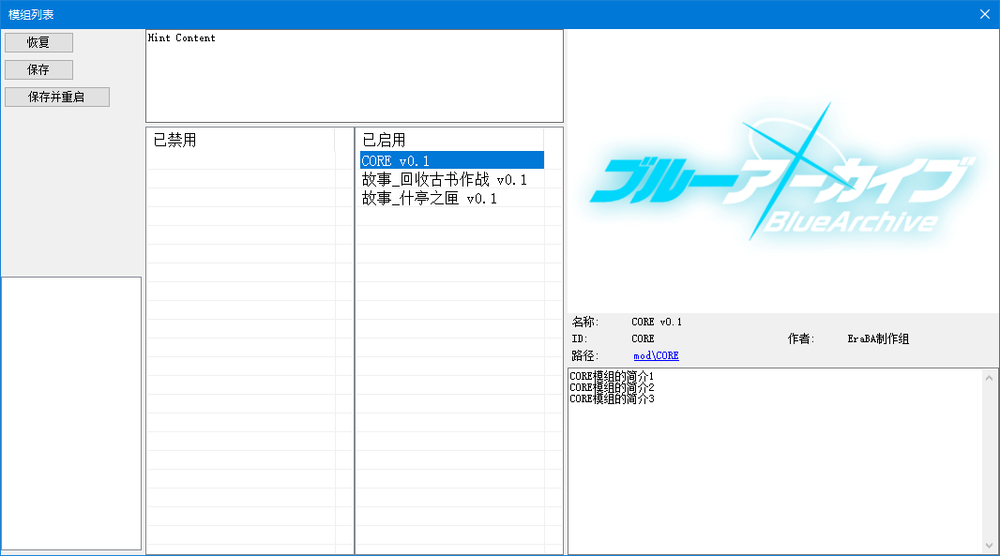
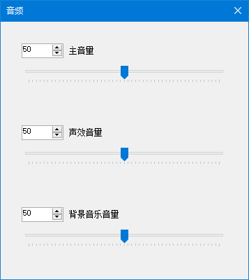

# 소개 {#Introduction}

<center>

</center>

**EmueraBA** 런처는 [**`EmueraEE+EM`**](https://gitlab.com/EvilMask/emuera.em) 런처를 기반으로 수정되었으며, 현재 `.NET Framework 4.8` 플랫폼을 사용하여 빌드됩니다.

런처의 기본 제목이 `EmueraBA`로 변경되었으며, 기본 아이콘도 변경되었습니다.

그래픽 라이브러리를 [**`SkiaSharp`**](https://github.com/mono/SkiaSharp)로 교체하여 화면 표시 및 이미지 그리기 기능이 SkiaSharp으로 완전히 전환되었습니다. **`描画インターフェース`** (그래픽 그리기 인터페이스) 설정 항목은 제거되었습니다.

자동 문자 범위 인식 기능이 구현되어 한글, 일본어, 영어, 이모지 문자를 정확히 인식하고 길이를 계산할 수 있게 되었습니다. **`内部で使用する東アジア言語`** (내부 사용 동아시아 언어) 설정 항목은 제거되었습니다.

표시 설정 화면에 **`タブ文字幅`** (탭 문자 너비) 설정 항목이 추가되었습니다. 이 설정은 텍스트 내 `탭 문자(\t)`의 길이를 조정하며, 기본값은 `8`입니다.  
탭 문자는 앞선 텍스트의 길이에 따라 자동으로 길이를 조정합니다. 예를 들어 탭 문자 앞에 `111`이라는 텍스트가 있으면 현재 탭 문자의 길이는 5가 됩니다.

사용자 정의 변수 키워드 **`RESIZE`** 가 추가되었습니다. 이 키워드는 배열 크기 재설정이 필요한 변수를 표시하는 데 사용됩니다. 자세한 사용법은 [**`ARRAYRESIZE`**](new_com#arrayresize)를 참조하세요.

----
### 모드 기능 {#ModuleFunc}

:::info[모드 기능]

**모드 로딩 메커니즘이 추가되었으며, 런처 메뉴 바에 `모드 목록` 대화창이 추가되어 모드 확인, 활성화/비활성화 및 로딩 순서 조정이 가능합니다.**

<center>

</center>

모드 추가 방법은 다음과 같습니다:

- 게임 메인 디렉터리에 `mod` 폴더를 생성합니다. 이 폴더는 **모드 메인 디렉터리**입니다.
- `mod` 폴더 아래에 **모드 폴더**를 생성합니다. 폴더 이름은 제한이 없으며(예: `MyMod`).
- `MyMod` 폴더 아래에 `_mod.csv`라는 **모드 식별 파일**을 생성하고 아래 표의 속성을 참고하여 내용을 작성합니다:

|속성         |설명|
|:---:        |---|
|ID           |모드의 고유 식별자. 공백이거나 다른 모드와 중복될 경우 인식되지 않습니다. **ID 이름이 함수 명명 규칙을 준수하는지 확인하고, 설정 후에는 수정하지 않는 것을 권장합니다**.|
|Name         |모드 표시 이름.|
|Authors      |모드 제작자 이름.|
|Cover        |모드 표시 커버 이미지. 모드 내부 이미지를 로드하려면 모드 경로로 `{0}`을 사용합니다(예: `{0}resources/cover.png`).|
|Description  |모드 간략 설명. 여러 줄로 작성 가능합니다. **Description 속성은 다른 속성 뒤에 작성해야 합니다**.|

```csv title="파일 경로 및 예시 내용: mod/MyMod/_mod.csv"
ID,MyMod
Name,내 모드 v1.0
Authors,Tom & Jerry
Cover,{0}resources/cover.png
Description,내 모드의 설명
내 모드 설명 1
내 모드 설명 2
```

이제 모드 폴더에 다음 리소스 파일을 추가할 수 있습니다:

- `ERB` 폴더 생성: `ERB, ERH, ERD` 파일 추가.
- `resources` 폴더 생성: `csv, png, jpg, webp` 등 이미지 리소스 추가.
- `sound` 폴더 생성: `csv, m4a, aac, wav, mp3` 등 오디오 리소스 추가.
- `text` 폴더 생성: `json` 형식의 다국어 리소스 추가.
- `font` 폴더 생성: `ttf, otf` 형식의 폰트 리소스 추가.

모드 내 리소스 파일은 게임 메인 디렉터리의 리소스 파일과 동일하나, 모드 간 리소스 중복 문제에 주의해야 합니다:

- `ERB, ERH, ERD` 파일 내용 중복 시 후순위 모드 내용은 건너뛰고 경고 발생.
- Sprite 리소스 이름 중복 시 동일 모드 내에서는 건너뛰고 경고, 다른 모드 간에는 후순위 모드 내용 우선 적용.
- Audio 리소스 이름 중복 시 동일 모드 내에서는 건너뛰고 경고, 다른 모드 간에는 후순위 모드 내용 우선 적용.
- 다국어 리소스 키 경로 중복 시 후순위 텍스트 및 모드 내용 우선 적용.
- 폰트 리소스 폰트명 중복 시 후순위 모드 내용 우선 적용.

:::

----
### 다국어 기능 {#Multilingual}

:::info[다국어 기능]

**다국어 기능을 통해 게임 내 텍스트를 체계적으로 정리하여 현지화 번역이 가능하며, 런처는 실행 시 사용 가능한 언어를 자동 통합하여 다국어 텍스트를 신속하게 표시합니다.**

다국어 텍스트 추가 방법(`한국어` 추가 예시):

- 게임 메인 디렉터리에 `text` 폴더 생성(**다국어 메인 디렉터리**).
- `text` 폴더 아래에 **지역 언어 폴더** 생성. 폴더명은 [**`지역별 언어`**](https://learn.microsoft.com/openspecs/windows_protocols/ms-lcid/a9eac961-e77d-41a6-90a5-ce1a8b0cdb9c) 문서의 `언어 태그(Language tag)`를 참조.
  - `Korean`의 지역명은 `ko-KR`입니다.
  - 폴더명은 대소문자 구분 없으며 `밑줄(_)`과 `하이픈(-)`을 혼용할 수 있으나, 대문자와 `밑줄(_)`로 통일하는 것을 권장합니다(예: `KO_KR`).
- `KO_KR` 폴더 아래에 임의의 `json` 파일 생성 후 다음 예시 내용 작성:

```json title="파일 경로 및 예시 내용: text/KO_KR/text.json"
{
  // 주석입니다.

  "키명": "내용",
  "START_GAME": "게임 시작",
  "ITEM": "아이템",
  "ITEM":
  {
    "APPLE":
    {
      "NAME": "사과",
      "DESC": "과일의 일종",
    },
    // 참고: 키명에 줄바꿈(\n)을 포함하지 마세요(예: BA\nNANA). 런처가 언어 통합 시 해당 문자를 활용하기 때문입니다.
    "BANANA":
    {
      "NAME": "바나나",
      "DESC":
      [
        "큰 바나나, 하나의 큰 바나나",
        "너의 느낌은 정말 신기해",
      ],
    },
  },
}
```

이제 `한국어` 다국어 텍스트 추가가 완료되었습니다. 설정에서 이 언어를 활성화합니다:

- 런처 실행 → `모드 목록` 진입 → 창 좌측 하단 `다국어 목록`에 `한국어` 옵션이 표시됩니다. 해당 옵션을 더블클릭하여 활성화한 후 `저장` 버튼 클릭.
  - 여러 언어를 추가한 경우 활성화된 언어를 드래그하여 표시 순서 조정 가능(상위일수록 우선순위 높음).
  - `모드 목록`에서 키 경로 중복 시 선순위 모드 텍스트가 후순위 모드로 대체됨.
  - `다국어 목록` 변경 후에는 프로그램 재시작 시 언어 텍스트 캐시와 상수 문자열로 재구성된 코드가 초기화됨.

마지막으로, 코드에서 [**`TEXT`**](new_com#text) 및 [**`TEXTLIST`**](new_com#textlist) 명령어를 사용해 다국어 텍스트 호출(json 파일에 정의한 키 경로 사용):

```
LOCALS '= TEXT("start_game")        ; "게임 시작" 텍스트 획득 (키명 대소문자 구분 안 함)
PRINTSL TEXT("ITEM")               ; "아이템" 출력
PRINTSL TEXT("ITEM", "APPLE", "DESC") ; "과일의 일종" 출력

TEXTLIST LOCALS, "ITEM", "APPLE", "DESC"
PRINTSL LOCALS:0                   ; "과일의 일종" 출력
TEXTLIST LOCALS, "ITEM", "BANANA", "DESC"
PRINTSL LOCALS:0                   ; "큰 바나나, 하나의 큰 바나나" 출력
PRINTSL LOCALS:1                   ; "너의 느낌은 정말 신기해" 출력
```

:::

----
### 오디오 기능 {#AudioFunc}

:::info[오디오 기능]

**오디오 컴포넌트를 [**`CSCore`**](https://github.com/filoe/cscore)로 교체하고, 런처 메뉴 바에 `오디오` 대화창을 추가하여 볼륨 조절이 가능합니다.**

<center>

</center>

이미지 리소스와 마찬가지로, `resources` 리소스 폴더에 오디오 파일을 배치하고 CSV 파일을 생성한 후 **Audio 리소스**를 정의하면 더욱 사용자 정의된 오디오 효과를 얻을 수 있습니다.

```csv title="Audio 리소스 작성 형식 및 예시:"
; Audio명,오디오 파일명,볼륨(100),시작 시간(00:00:00),재생 길이(오디오 파일 총 길이)
MyMusic,MyMusic.mp3
MyMusic1,MyMusic1.mp3,100
MyMusic2,MyMusic2.m4a,80,00:01:30
MyMusic3,MyMusic3.wav,70,00:01:30,15000
```

CSV 파일의 `시작 시간`과 `재생 시간` 속성은 `TimeSpan` 또는 `ms(밀리초)` 값을 허용합니다. `TimeSpan` 서식은 [**`TimeSpan.TryParse`**](https://learn.microsoft.com/dotnet/api/system.timespan.tryparse?view=netframework-4.8) 문서 예시 참조.

오디오 기능에 대한 자세한 내용은 [**`오디오 관련`**](new_com#AudioRelated) 명령어를 참조하세요.

:::

----
### Spine 애니메이션 기능 {#SpineAnimFunc}

:::info[Spine 애니메이션 기능]

[**`Spine 런타임`**](https://ko.esotericsoftware.com/spine-runtimes) 지원이 추가되어 Spine 애니메이션 파일을 읽고 [**`SkiaSharp`**](https://github.com/mono/SkiaSharp)으로 렌더링할 수 있습니다.

현재 `3.8.xx` 버전의 Spine 리소스만 지원됩니다.

Spine 리소스 추가 방법은 이미지 리소스와 유사합니다. `resources` 폴더에 Spine 리소스를 배치하고 csv 파일에 다음 내용 작성:

```csv title="Spine 리소스 작성 형식 및 예시:"
; Spine 리소스명,atlas 파일,skel 파일 또는 json 파일
aris_spine, aris.atlas, aris.skel
```

이후 [**`SPINECREATE`**](new_com#spinecreate), [**`CBGSETSPINE`**](new_com#cbgsetspine) 등 명령어로 Spine 애니메이션을 생성하고 화면에 표시할 수 있습니다.

```erb title="Spine 관련 명령어 사용 예시:"
; 애니메이션 갱신 간격 설정(밀리초 단위)
SETANIMETIMER 1000 / 60

; 지정된 ID로 Spine 애니메이션 생성
SPINECREATE 0, "aris_spine"

; Spine 애니메이션 스케일 50% 설정
SPINESETSCALE 0, 50

; Spine 애니메이션에 ANIM 설정
SPINESETANIM 0, 0, "IDLE_01", 1
SPINESETANIM 0, 1, "00", 1

; 지정된 Spine 애니메이션을 화면에 표시
CBGSETSPINE 0, 0, 0, 1
```

Spine 애니메이션 기능에 대한 자세한 내용은 [**`SPINE 관련`**](new_com#SpineRelated) 명령어를 참조하세요.

:::

----
### 확장 변수 타입 {#ExtendedVariableType}

:::info[확장 변수 타입]

다음 변수 타입이 추가되었습니다:

- 리스트: `List<value>` 구현.
  - 선언 형식: **`#LIST(S) <변수명>`**  
    예시: `#LIST MY_LIST` → `정수` 타입, `MY_LIST` 이름의 리스트 변수 선언.

- 해시 리스트: `HashSet<value>` 구현.
  - 선언 형식: **`#HASHLIST(S) <변수명>`**  
    예시: `#HASHLISTS MY_HASHLIST` → `문자열` 타입, `MY_HASHLIST` 이름의 해시 리스트 변수 선언.

- 딕셔너리: `Dictionary<key, value>` 구현.
  - 선언 형식: **`#DICT_(I|S)(I|S) <변수명>`**  
    예시: `#DICT_IS MY_DICT` → 키 `정수` 타입, 값 `문자열` 타입, `MY_DICT` 이름의 딕셔너리 변수 선언.

- 리스트형 딕셔너리: `Dictionary<dictKey, List<value>>` 구현.
  - 선언 형식: **`#DICT(S)_LIST(S) <변수명>`**  
    예시: `#DICTS_LIST MY_DICTLIST` → 주키 `문자열` 타입, 값 `정수` 타입, `MY_DICTLIST` 이름의 리스트형 딕셔너리 변수 선언.

- 해시 리스트형 딕셔너리: `Dictionary<dictKey, HashSet<value>>` 구현.
  - 선언 형식: **`#DICT(S)_HASHLIST(S) <변수명>`**  
    예시: `#DICTS_HASHLIST MY_DICTHASHLIST` → 주키 `문자열` 타입, 값 `정수` 타입, `MY_DICTHASHLIST` 이름의 해시 리스트형 딕셔너리 변수 선언.

- 딕셔너리형 딕셔너리: `Dictionary<dictKey, Dictionary<key, value>>` 구현.
  - 선언 형식: **`#DICT(S)_DICT_(I|S)(I|S) <변수명>`**  
    예시: `#DICTS_DICT_IS MY_DICTDICT` → 주키 `문자열` 타입, 부키 `정수` 타입, 값 `문자열` 타입, `MY_DICTDICT` 이름의 딕셔너리형 딕셔너리 변수 선언.

`GLOBAL`, `SAVEDATA`, `DYNAMIC`, `REF` 키워드와 함께 선언 가능합니다.  
`SAVEDATA` 키워드와 함께 선언 시 **`バイナリデータライターのバージョン`** (바이너리 세이브 기록기 버전) 설정을 `1809` 이상으로 변경해야 합니다.

확장 변수의 기능에 대해 더 알아보려면 [**`리스트 관련`**](new_com#ListRelated), [**`해시 리스트 관련`**](new_com#HashListRelated), [**`딕셔너리 관련`**](new_com#DictRelated), [**`딕셔너리 아이템 관련`**](new_com#DictItemRelated) 명령어를 참조하세요.

```erb title="확장 변수 사용 예시:"
#LIST MY_LIST
#HASHLISTS MY_HASHLIST
#DICT_IS MY_DICT
#DICTS_LIST MY_DICTLIST
#DICTS_HASHLIST MY_DICTHASHLIST
#DICTS_DICT_IS MY_DICTDICT

LISTADD MY_LIST, 10       ; MY_LIST에 값 10 추가
PRINTVL MY_LIST:0         ; MY_LIST의 0번 요소 출력 → "10"

HASHLISTADD MY_HASHLIST, "TEXT"          ; MY_HASHLIST에 값 "TEXT" 추가
PRINTVL HASHLISTHAS(MY_HASHLIST, "TEXT") ; "TEXT" 검색 결과 출력 → "1"

MY_DICT:6 '= "TEXT"       ; MY_DICT에 키 6, 값 "TEXT" 요소 추가
PRINTSL MY_DICT:6         ; 키 6의 값 출력 → "TEXT"

DICTITEMCREATE MY_DICTLIST, "NEW"    ; MY_DICTLIST에 "NEW" 리스트 생성
LISTADD MY_DICTLIST:"NEW", 20        ; "NEW" 리스트에 값 20 추가
PRINTVL MY_DICTLIST:"NEW":0          ; "NEW" 리스트 0번 요소 출력 → "20"

DICTITEMCREATE MY_DICTHASHLIST, "NEW" ; MY_DICTHASHLIST에 "NEW" 해시 리스트 생성
HASHLISTADD MY_DICTHASHLIST:"NEW", 20 ; "NEW" 해시 리스트에 값 20 추가
PRINTVL HASHLISTHAS(MY_DICTHASHLIST:"NEW", 20) ; 값 20 검색 결과 출력 → "1"

DICTITEMCREATE MY_DICTDICT, "NEW"    ; MY_DICTDICT에 "NEW" 딕셔너리 생성
MY_DICTDICT:"NEW":8 '= "TEXT"        ; "NEW" 딕셔너리에 키 8, 값 "TEXT" 요소 추가
PRINTSL MY_DICTDICT:"NEW":8          ; 키 8의 값 출력 → "TEXT"
```

:::

----
### 프로그램 및 명령어 호환성 변경사항 {#CompatibilityChanges}

`함수형 매크로 정의` 기능 제한이 해제되었습니다. 안정성은 완전히 테스트되지 않았습니다.

**`キャラクタ変数の引数を補完しない`** (캐릭터 변수 인수 자동 완성 비활성) 설정이 꺼진 경우, 캐릭터형 2차원 배열에서 첫 번째 인수 생략이 가능합니다.

`__FILE__` 변수가 반환하는 파일 경로의 역슬래시 `\\`가 슬래시 `/`로 대체되었습니다.

[**`REPLACE`**](modify_com#replace) 명령어의 한 매개변수 형식이 독립 명령어 [**`REPLACEBYARRAY`**](new_com#replacebyarray)로 분리되었습니다.

다음 명령어들이 이모지 문자🎉 처리를 지원합니다(이모지 문자는 표시 너비 계산으로 대략적인 길이 측정).  
예시: `😀` 길이=2, `👨‍👩‍👧‍👦` 길이=4.

- [**`STRLEN, STRLENFORM`**](modify_com#strlen-strlenform)
- [**`STRFIND`**](modify_com#strfind)
- [**`STRLENS`**](modify_com#strlens)
- [**`SUBSTRING`**](modify_com#substring)

[**`SUBSTRING`**](modify_com#substring) 명령어의 경계 문자 처리 로직이 변경되었습니다. 텍스트 선택 위치가 긴 문자 중간에 걸릴 경우 해당 문자 시작 위치로 후퇴합니다.  
즉, 시작 위치에 걸린 문자는 포함되고 끝 위치에 걸린 문자는 무시됩니다.

[**`ERDNAME`**](modify_com#erdname) 명령어의 세 번째 인수 생략 시 배열 마지막 차원의 인덱스 키명을 검색합니다.

[**`INPUTMOUSEKEY`**](modify_com#inputmousekey) 명령어가 추가로 `RESULTS:0`과 `RESULT:3` 값을 변경합니다.

[**`GCREATE`**](modify_com#gcreate), [**`GCREATEFROMFILE`**](modify_com#gcreatefromfile), [**`GLOAD`**](modify_com#gsave-gload) 명령어는 이미지 생성 전 기존 이미지를 해제하므로, 생성 전 [**`GDISPOSE`**](https://osdn.net/projects/emuera/wiki/excom#h5-GDISPOSE.20int.20ID) 명령어 호출이 필요 없습니다.

[**`GCREATEFROMFILE`**](modify_com#gcreatefromfile) 명령어의 두 번째 인수는 메인 디렉터리 기준 상대 경로여야 하며, 세 번째 인수는 제거되었습니다.

[**`GDASHSTYLE`**](modify_com#gdashstyle) 명령어의 선 캡 효과가 변경되었습니다.

[**`GDRAWTEXT`**](modify_com#gdrawtext) 명령어는 `RESULT:0`만 반환하며 다른 반환값은 무효화됩니다.

[**`GDRAWGWITHMASK`**](modify_com#gdrawgwithmask)의 그리기 결과는 알파 값과 파란색 값의 영향을 받습니다.

그래픽 라이브러리 교체로 인해 [**`GDRAWG`**](modify_com#gdrawg), [**`GDRAWSPRITE`**](modify_com#gdrawsprite) 명령어의 컬러 매트릭스 사용법이 변경되었습니다. 자세한 내용은 [**`GSETCOLORMATRIX`**](new_com#gsetcolormatrix) 명령어 설명 참조.

[**`SETANIMETIMER`**](modify_com#setanimetimer) 명령어는 [**`TINPUT`**](https://evilmask.gitlab.io/emuera.em.doc/Reference/TINPUT.html) 또는 [**`INPUTMOUSEKEY`**](modify_com#inputmousekey) 같은 대기 시간 중에도 애니메이션 갱신을 계속합니다.

[**`SPRITECREATE`**](modify_com#spritecreate), [**`SPRITEANIMECREATE`**](modify_com#spriteanimecreate) 명령어는 스프라이트 생성 전 비내장 스프라이트를 해제하므로, 생성 전 [**`SPRITEDISPOSE`**](modify_com#spritedispose) 호출이 필요 없습니다. 동일한 이름의 내장 스프라이트가 존재하면 생성 실패.

[**`SPRITEDISPOSEALL`**](modify_com#spritedisposeall) 명령어는 내장 스프라이트 제거 기능이 없어지고, 모든 내장 스프라이트가 참조하는 이미지를 해제할 수 있습니다.

[**`PLAYBGM`**](modify_com#playbgm), [**`PLAYSOUND`**](modify_com#playsound) 명령어의 첫 번째 인수는 Audio 이름만 지원합니다. 오디오 파일 경로로 재생하려면 [**`AUDIOCREATEFROMFILE`**](new_com#audiocreatefromfile) 명령어로 Audio를 먼저 생성하세요.  
내장 Audio 리소스 추가 방법은 [**`오디오 기능`**](#AudioFunc) 참조.

[**`SETBGMVOLUME`**](modify_com#setbgmvolume) 명령어는 현재 재생 중인 BGM 볼륨만 변경하며 전역 볼륨에 영향을 주지 않습니다.

[**`SETSOUNDVOLUME`**](modify_com#setsoundvolume) 명령어는 더 이상 효과가 없어 사용되지 않습니다.

[**`ENUMFILES`**](modify_com#enumfiles) 명령어가 반환하는 파일 경로의 역슬래시 `\\`가 슬래시 `/`로 대체되었습니다.

HTML 코드 변경사항:
- `div` 태그의 `bcolor` 속성이 `bdcolor`(borderColor)로 이름 변경(`bcolor`(backgroundColor)과 혼동 방지).
- `div` 태그의 `bdcolor` 속성 입력 형식이 `'color'` 단일 색상값으로 변경(사각형 색상값 비지원).
- `div` 태그의 `border` 속성 입력 형식이 `'thick'` 단일 수치로 변경(사각형 수치 비지원).
- `div` 태그의 `margin` 속성 효과가 외부 확장으로 변경(내부 압축 비활성).

메뉴 바의 `タイトルに戻る`(타이틀 화면으로) 버튼 클릭 시 다음 내용이 추가로 초기화됩니다:

- 모든 CBG 이미지(CBGBUTTON, CBGBMAP 등) 초기화 → [**`CBGCLEAR`**](https://osdn.net/projects/emuera/wiki/excom#h5-GCLEAR.20int.20ID.2C.20int.20cARGB) 명령어 효과
- 런타임 생성된 모든 스프라이트 초기화 및 참조 이미지 해제 → [**`SPRITEDISPOSEALL`**](modify_com#spritedisposeall) 명령어 효과
- 런타임 생성된 모든 Spine 애니메이션 초기화 및 참조 이미지 해제 → [**`SPINEDISPOSEALL`**](new_com#spinedisposeall) 명령어 효과
- 런타임 생성된 모든 Audio 초기화 및 오디오 캐시 해제 → [**`AUDIODISPOSEALL`**](new_com#audiodisposeall) 명령어 효과

`emuera.log` 게임 로그와 `console.log` 디버그 로그가 `UTF-8-BOM` 인코딩으로 저장됩니다.

`watchlist.csv` 변수 모니터링 목록이 `UTF-8-BOM` 인코딩으로 저장 및 로드됩니다.

디버그 창 종료 시 변수 모니터링 목록 자동 저장이 비활성화되었습니다.
